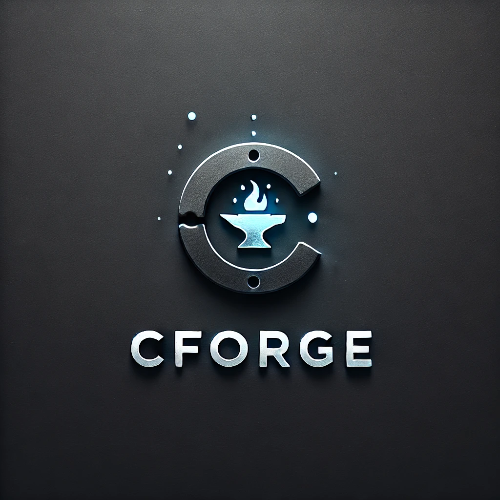

# cForge – Learn C by Rebuilding It 🧠💻  

**cForge** is a **custom C library project** created to **practice, explore, and master the C programming language**.  
It provides a hands-on environment where every core component, such as `stdio`, `string`, and `malloc`, is **rebuilt from scratch** to understand how C works internally.  

Instead of trying to replace libc, **cForge** is focused on **education**.  
It helps developers strengthen their knowledge of **low-level programming**, **system calls**, and **portable software design**, while staying **lightweight**, **dependency-free**, and **enjoyable to build and experiment with**.

## 🧩 Development Philosophy

**cForge** is a project built for learning, not replacing libc.  
The goal is to explore how standard C behaves by rebuilding it one function at a time, gaining insight into how compilers, system calls, and memory management work underneath.

This project follows a **progressive learning approach**:

1. **Start with existing C functions** – use the real standard library to study correct behavior and edge cases.  
2. **Rebuild from scratch** – implement your own versions using pointers, buffers, and system calls.  
3. **Compare and analyze** – validate against libc to understand correctness, performance, and portability.  
4. **Document the journey** – each function includes notes, design choices, and takeaways to reinforce understanding.

By doing this, **cForge** becomes a personal lab for mastering C fundamentals from basic I/O to low-level systems programming while staying simple, transparent, and fun.