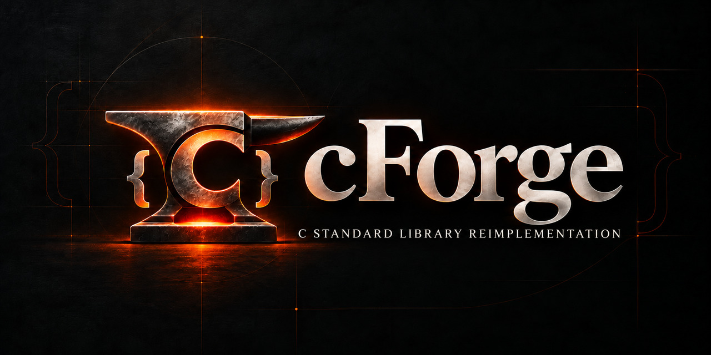

<div align="center">

# cForge



<strong>C Standard Library Reimplementation</strong>

[](CMakeLists.txt)
[](CMakeLists.txt)
[](https://github.com/Ahren27/cForge/actions/workflows/ci.yml)
[](LICENSE)

[](.github/workflows/ci.yml)
[](.github/workflows/ci.yml)
[](.github/workflows/ci.yml)
[](.clang-format)
[](#current-status)

[Getting Started](#getting-started) ·
[Function Tracker](docs/supported-functions.md) ·
[Design Notes](docs/design.md) ·
[Contributing](CONTRIBUTING.md)

</div>

---

## About

cForge is an independent educational project for reimplementing C standard
library functions from scratch. It focuses on function contracts, pointer and
memory operations, portable C, and testing defined behavior.

## Current Status

> [!NOTE]
> **Project setup is in place; library implementation has not started.**

The repository currently contains CMake configuration, a GitHub Actions workflow,
a formatting configuration, and project documentation. There are no library
functions, public headers, or automated tests yet.

The CI badge reflects the build setup only. It does not indicate that any library
functions have been compiled or tested. cForge is not ready for use as a library
or as a replacement for a system libc.

See the [Function Tracker](docs/supported-functions.md) for the planned scope and
[Design Notes](docs/design.md) for initial implementation decisions.

## Getting Started

### Requirements

- Git
- CMake **3.20 or newer**
- A C17-capable compiler, such as GCC, Clang, or MSVC
- A build tool supported by your CMake generator, such as Make, Ninja, or Visual Studio

### Configure And Build

Clone the repository and check the current build setup:

```sh
git clone https://github.com/Ahren27/cForge.git
cd cForge
cmake -S . -B build -DCMAKE_BUILD_TYPE=Debug
cmake --build build --config Debug
```

These commands configure the C toolchain and run the generated build system.
They do not produce a library yet. CTest is enabled, but no tests are registered.
Instructions for running tests and examples will be added with the first
implementation.

## Development Setup

### Continuous Integration

The [CI Workflow](.github/workflows/ci.yml) runs on pushes and pull requests to
`main`, using GCC and Clang on Ubuntu and MSVC on Windows. It selects a Release
configuration for each platform.

### Formatting

The [clang-format Configuration](.clang-format) uses four spaces and opening
braces on the same line. Install clang-format when you begin adding C files;
formatting is not currently checked by CI.

### Planned Tooling

The planned test framework is Criterion, with CTest as the test runner.
AddressSanitizer, UndefinedBehaviorSanitizer, and Valgrind checks are planned
alongside the test harness. None of these checks is integrated yet, and they are
not dependencies of the current setup. CMake presets and static-analysis
configuration have not been added.

## Repository Guide

| Location | Purpose |
| --- | --- |
| `CMakeLists.txt` | C17 toolchain configuration and CTest enablement |
| `.github/workflows/ci.yml` | Cross-platform build setup checks |
| `.clang-format` | C source formatting rules |
| `.gitignore` | Build output and local-file exclusions |
| `docs/assets/` | Project banner |
| [Function Tracker](docs/supported-functions.md) | Planned functions and completion criteria |
| [Design Notes](docs/design.md) | Scope, naming, dependencies, and testing approach |
| [Contributing](CONTRIBUTING.md) | Contribution and review guidelines |
| [Security Policy](SECURITY.md) | Reporting security-relevant defects |
| [Code Of Conduct](CODE_OF_CONDUCT.md) | Community expectations |

## Next Milestone

Implement `cforge_strlen` with a public header, a CMake library target, and
registered tests. Use that first function to establish the build and testing
pattern for the rest of the project.

Strings and memory operations come first, followed by character handling and
integer conversions. See the Function Tracker for the initial backlog.

## Contributing

Bug reports, tests, documentation improvements, and code reviews are welcome.
Implementing the functions is part of the learning goal, so please open an issue
before starting a large implementation or changing the project design.

Read the [Contributing Guide](CONTRIBUTING.md) before submitting changes. Report
suspected security vulnerabilities using the [Security Policy](SECURITY.md).

## License

cForge is licensed under the [MIT License](LICENSE).
